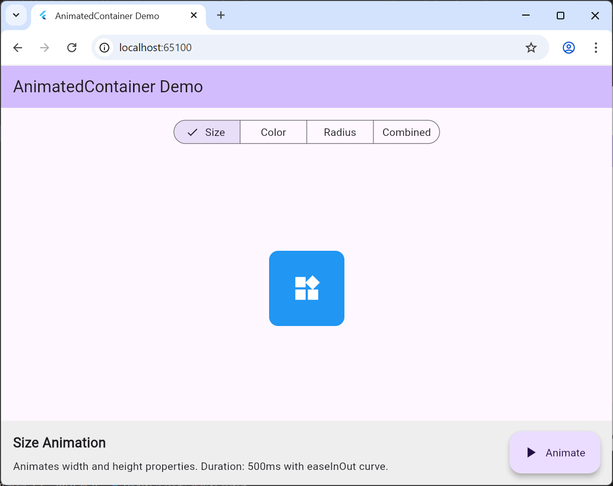

# animated_container_demo

A new Flutter project.

## Getting Started

# AnimatedContainer Demo

A comprehensive Flutter demonstration project showcasing the `AnimatedContainer` widget - Flutter's implicit animation widget that automatically animates changes to its properties.

## Problem Statement

Creating smooth animations in mobile apps traditionally requires complex animation controllers, tweens, and manual state management. This creates boilerplate code and increases development time for simple UI transitions.

## Solution

`AnimatedContainer` solves this by providing **implicit animations** - simply change property values in `setState()` and the widget automatically animates the transition. Perfect for real-world scenarios like expandable cards, button feedback, theme transitions, and loading states.

## Demo Features

This interactive demo showcases 4 animation scenarios:

1. **Size Animation** - Width and height transitions
2. **Color Animation** - Color and shadow effects
3. **Border Radius Animation** - Shape morphing (square to circle)
4. **Combined Animation** - Multiple properties animated together



## Quick Start

### Prerequisites
- Flutter SDK installed
- Chrome browser (for web) or any device/emulator

### Run the Demo

**For presentations (recommended - runs in browser):**
```bash
cd animated_container_demo
flutter run -d chrome
```

**For Windows desktop:**
```bash
flutter run -d windows
```

**For mobile:**
```bash
flutter run
```

## Three Key Widget Properties Demonstrated

### 1. `duration` Property

**Type:** `Duration` (required)

**Default Value:** None (must be specified)

**Our Implementation:**
```dart
AnimatedContainer(
  duration: const Duration(milliseconds: 500),  // Half a second
  // other properties...
)
```

**Visual Effect:** Controls how long the animation takes to complete. Shorter durations (200-300ms) create snappy animations, while longer durations (800-1000ms) create more dramatic, noticeable transitions.

**Why Adjust It:** 
- **Quick feedback (200-300ms)**: Button presses, hover effects
- **Standard UI (400-600ms)**: Card expansions, modal appearances  
- **Emphasis (800-1000ms)**: Drawing attention to important changes
- Different durations shown in each tab (Size: 500ms, Color: 800ms, Radius: 600ms, Combined: 700ms)

**Live Demo:** Switch between tabs to see different duration effects - the Color tab (800ms) animates noticeably slower than the Size tab (500ms).

---

### 2. `curve` Property

**Type:** `Curve`

**Default Value:** `Curves.linear` (constant speed)

**Our Implementation:**
```dart
AnimatedContainer(
  duration: const Duration(milliseconds: 500),
  curve: Curves.easeInOut,  // Smooth acceleration & deceleration
  // other properties...
)
```

**Visual Effect:** Defines the animation's acceleration pattern. `Curves.easeInOut` starts slow, speeds up in the middle, then slows down at the end - creating the most natural-feeling animation. `Curves.elasticOut` (used in the Combined tab) creates a bouncy spring effect.

**Why Adjust It:**
- **`easeInOut`**: Most natural for 90% of UI animations (used in tabs 1-3)
- **`elasticOut`**: Playful, attention-grabbing effects (tab 4 Combined example)
- **`linear`**: Progress bars, loading indicators
- **`bounceOut`**: Fun, game-like interactions

**Live Demo:** Compare the smooth easeInOut in the Size tab versus the bouncy elasticOut in the Combined tab.

---

### 3. `decoration` Property (with `BoxDecoration`)

**Type:** `Decoration?` (nullable)

**Default Value:** `null` (no decoration)

**Our Implementation:**
```dart
AnimatedContainer(
  duration: const Duration(milliseconds: 800),
  decoration: BoxDecoration(
    color: _color,  // Animatable
    borderRadius: BorderRadius.circular(_borderRadius),  // Animatable
    boxShadow: [
      BoxShadow(
        color: _color.withOpacity(0.5),
        blurRadius: 20,
        spreadRadius: 5,
      ),
    ],
  ),
)
```

**Visual Effect:** Enables complex visual styling including background color, border radius, shadows, and gradients. When these values change, AnimatedContainer smoothly transitions between them - the Color tab demonstrates blue→red color animation while the shadow color automatically animates too.

**Why Adjust It:**
- **Color animations**: Theme switching, state indicators
- **Border radius**: Shape morphing (square to circle in Radius tab)
- **Shadows**: Elevation changes, hover effects, focus states
- **Gradients**: Background transitions, loading shimmer effects

**Live Demo:** 
- **Color tab**: Watch color and shadow animate together
- **Radius tab**: See border radius morph from square (0) to circle (100)
- **Combined tab**: Multiple decoration properties animate simultaneously

---

## Project Structure

```
animated_container_demo/
├── lib/
│   └── main.dart                 # Main application (296 lines)
└── README.md                     # This file
```

## How AnimatedContainer Works

```dart
// 1. Define state variables
double _width = 100;

// 2. Pass to AnimatedContainer
AnimatedContainer(
  duration: Duration(milliseconds: 500),
  curve: Curves.easeInOut,
  width: _width,  // Uses current value
)

// 3. Change in setState() - animation happens automatically!
void _animate() {
  setState(() => _width = 200);
}
```

**Key Concept:** AnimatedContainer sees old value (100) and new value (200), then automatically creates smooth transition over the specified duration using the specified curve.

## Real-World Use Cases

- **Expandable Cards**: Smooth height transitions for show/hide content
- **Button Feedback**: Size/color changes on press
- **Loading States**: Pulsing containers, size changes
- **Theme Switching**: Color transitions between light/dark modes
- **Modal Animations**: Smooth entry/exit effects
- **Focus Indicators**: Border color/shadow changes
